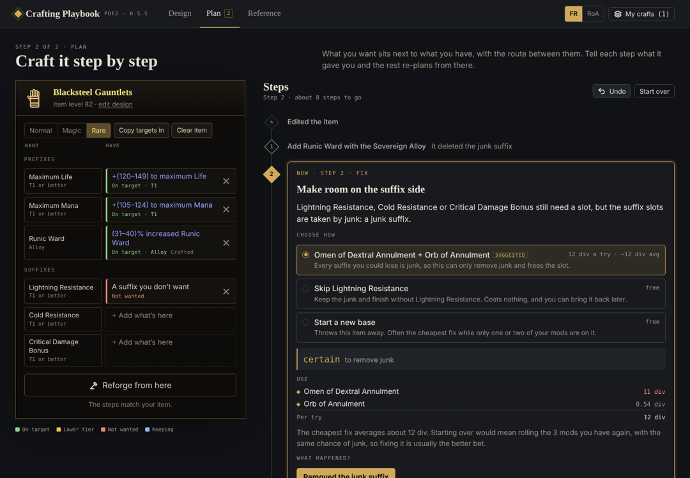

# PoE2 Crafting Playbook

Plan a Path of Exile 2 craft from an empty base to a finished rare.



- **Design** the item: pick a slot and base (or type a base name like Cryptic Leggings to jump straight to it), then choose the prefixes and suffixes you want from the mods that can actually roll on that base, with a minimum tier for each. Every box shows how that mod gets there: on the base, an Exalt slam with rough odds, an alloy or essence in your crafted slot (two with Astrid's Creativity socketed), or a desecration pick.
- **Forge** it step by step: steps 1 and 2 ask what kind of item you start with (one you have or one you'll buy) and what's on it (start from nothing, from an item in progress, or let Suggest fill in what a magic or rare base should already have, then step 3 says what to buy and lets you set the tiers you got), and the plan updates as soon as you change your item or your targets. Undo takes back changes to your item and recorded steps, one at a time. Each step lists what to use, what it costs and the odds, and the Cost & shopping list button shows what the rest costs if every roll lands, the average with misses, what you have spent so far, and what to buy. Tell it what happened ("Got Cold Resistance", "Something else…") and it re-plans. Mark unwanted mods Keep or Ditch. When junk blocks a slot it compares fixing, skipping a target and starting over, each with what it still costs to finish. When the last mod needs a second crafted slot (like Effect of Socketed Augment Items, which only the Essence of Horror adds), it explains Astrid's Creativity and walks you through socketing it.
- **Copy for a chat** on both screens copies your craft as text (the base, what you want, where the item is now and the steps) to paste into Claude or ChatGPT when you want to talk it through.
- **Reference**: the general crafting order, rules, quick fixes and every main material with where it drops and its price (Forbidden Rites or Runes of Aldur).
- **Story**: new to Path of Exile 2's story? Read it at 50, 100, 250, 500 or 1,000 words, plus a fact at a time.

Data comes from [Path of Building PoE2](https://github.com/PathOfBuildingCommunity/PathOfBuilding-PoE2)'s game files. Prices are a poe.ninja snapshot (October 4–5, 2026). Odds are rough: the game data has no spawn weights, so every tier counts the same.

## Use it

- Open `docs/index.html` in a browser, or `npm run serve` and go to http://localhost:8080.
- In claude.ai it runs as an artifact, where crafts sync to your account between devices. As a plain page they're kept in the browser. The Saved button in the header shows which, and the gold + next to it starts a new craft.

## Develop

```bash
npm run build   # assemble docs/index.html and dist/artifact.html
npm test        # planner tests
npm run e2e     # browser walk-through (needs Playwright)
npm run data    # refresh game data from Path of Building
```

See [CLAUDE.md](CLAUDE.md) for how the planner and the app are put together.
